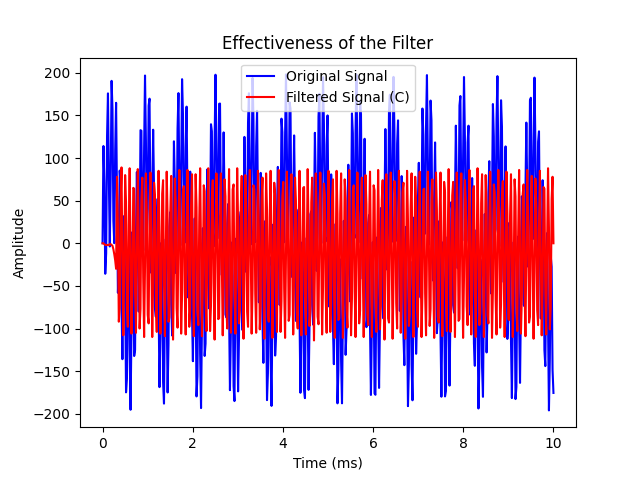

# common-embedded-filters
A collection of common DSP filters used in embedded systems, implemented with the option for floating point and fixed point math. Includes a filter designer utility that allows users to generate coefficients for FIR and IIR filters on the fly, and evaluate filter performance before implementing in an embedded system.
# Command Line Implementation
Located in `cmd_line_impl`, a command line program implementing each of the filters in `impl`. This program is used in conjunction with the `filter_designer` tool, but can also be utilized standalone.
## Compiling
Simply use the Makefile to compile the command line program, if you are attempting to compile it standalone, you will need to create several files that are auto generated by the `filter_designer` tool. I recommend doing the following:
```
python3 ./filter_designer/filter_designer.py -e filter_designer/example_configs/fir_bp.cfg
python3 ./filter_designer/filter_designer.py -e filter_designer/example_configs/iir_biquad_bp.cfg
cd cmd_line_impl
make clean
make
```
By running the `filter_designer` tool, you can auto generate the coefficient files and see how they are structured. Then you can modify the files as you please.
## Running
To run the command line tool, simply call the program and pass in an input file to filter and an output file to write the filter data to. Specify the filter and filter subtype.
```
./cmd_line_imple/filter_example -i {input_file} -o {output_file} -f {filter_type} -s {filter_mode}
```
An example call using a provided example dataset:
```
./cmd_line_imple/filter_example -i example_data_sets/low_freq_test.log -o output.log -f fir -s lowpass
```
# Filter Designer
Located in the `filter_designer` directory, the `filter_designer` tool is a python program that leverages the [scipy.signal](https://docs.scipy.org/doc/scipy/reference/signal.html) library to generate coefficients for comman FIR, IIR, and IIR Biquad filters. This tool seemlessly integrates into the command line program to test and display the performance of your new filter instantly. 
## How it Works
Provide the `filter_designer` tool with your required parameters (more on this below) and it will auto generate filter coefficients. It will then auto generate coefficient files, compile the command line program, and run it on a synthesized data set with a combination of frequencies in the pass band and in the stop band. You will be provided with a pre and post filtered signal, an FFT on the pre and post filtered signal, and plot of the filter's frequency response. You can choose floating or fixed point implementation of the filter by defining `ENABLE_FLOATING_POINT_MATH` at compile time. See `impl/fixed_point.h` for more information there.
## Using the Filter Designer Tool
The `filter_designer` tool can be passed command line arguments directly, or you can provide a configuration file. Due to the large number of command line combinations, I highly recommend using a configuration file. There are example configuration files for the `filter_designer` tool in `filter_designer/example_configs`, below I will show you some example runs and output generated.
### Generate a 31'st order FIR high pass filter using fixed point implementation
```
./python3 ./filter_designer/filter_designer.py -e filter_designer/example_configs/fir_hpf.cfg
```
Output:
```
Key: filter, Value: fir
Key: mode, Value: highpass
Key: order, Value: 31
Key: sampling_rate, Value: 50
Key: start_cutoff, Value: 5
Key: verbose, Value: True
Key: window, Value: hamming
Key: fir_algorithm, Value: firwin
Filter Type: fir
Filter Mode: highpass
Filter Order: 31
Sampling Rate: 50.0
Start Cutoff: 5.0
Stop Cutoff: 0
Use SOS: False
Ripple: None
Verbose: True
IIR Filter Type: butter
FIR Window: hamming
FIR Algorithm: firwin
Debug: False
Scipy Version: 1.12.0
Critical Frequencies: [5.0]
H: [ 8.53047054e-18 -1.20408459e-03 -2.79048832e-03 -4.23666924e-03
 -3.95148698e-03 -9.67241718e-18  8.27504584e-03  1.86243264e-02
  2.54459967e-02  2.12822929e-02  2.40250362e-17 -3.96757033e-02
 -9.20921859e-02 -1.45420120e-01 -1.85311986e-01  8.00409707e-01
 -1.85311986e-01 -1.45420120e-01 -9.20921859e-02 -3.96757033e-02
  2.40250362e-17  2.12822929e-02  2.54459967e-02  1.86243264e-02
  8.27504584e-03 -9.67241718e-18 -3.95148698e-03 -4.23666924e-03
 -2.79048832e-03 -1.20408459e-03  8.53047054e-18]
Frequency in Stop Band: 1.2842074851806013
Frequency in Pass Band: 10.881466811270972
rm -f filter_example sma_filter.o iir_filter.o iir_coefficients.o fir_filter.o fir_coefficients.o main.o
gcc -Wall -g -c ../impl/sma_filter/sma_filter.c
gcc -Wall -g -c ../impl/iir_filter/iir_filter.c
gcc -Wall -g -c ../impl/iir_filter/iir_coefficients.c
gcc -Wall -g -c ../impl/fir_filter/fir_filter.c
gcc -Wall -g -c ../impl/fir_filter/fir_coefficients.c
gcc -Wall -g -c main.c
gcc -Wall -g -o filter_example sma_filter.o iir_filter.o iir_coefficients.o fir_filter.o fir_coefficients.o main.o
Input file: example_data_sets/fir_test_signal.log
Output file: example_data_sets/fir_filtered_signal.log
Filter type: fir
Sub filter type: highpass
filter_coeff_t: 64 bits
filter_data_t: 32 bits
filter_accum_t: 64 bits
Average time delta: 19.959999 ms
Average sample rate: 50.100203 Hz
```
The following plots will be generated displaying the filters performance:



The following files will be generated for the filter configuration and coefficients:
`impl/fir_filter/fir_coefficients.c`
`impl/fir_filter/fir_config.h`

The following logs will be generated with synthesized input and direct output of the command line program:
`example_data_sets/fir_test_signal.log`
`example_data_sets/fir_filtered_signal.log`
# Implementing in Your Embedded System Project
I highly recommend using the `filter_design` tool to auto generate coefficient files, and coefficients for your filter. However you are free to make your own coefficients and coefficient structures as you like. You can always use the tool to auto generate the files and then replace with your own coefficients.

To choose between floating point and fixed point math, see `impl/fixed_point.h`.

To integrate into your project, simple drop the entire `impl` directory into your project, or reference it from your project directly. To create a filter you will have to initialize a filter object struct, each of which are defined in the filter implementation sub directories. See `cmd_line_impl` for example initializations of the struct objects.

Thats it! Hopefully you find this project useful, please feel free to log any issues, bugs, or feature requests. Or make your desired modifications and open a PR.